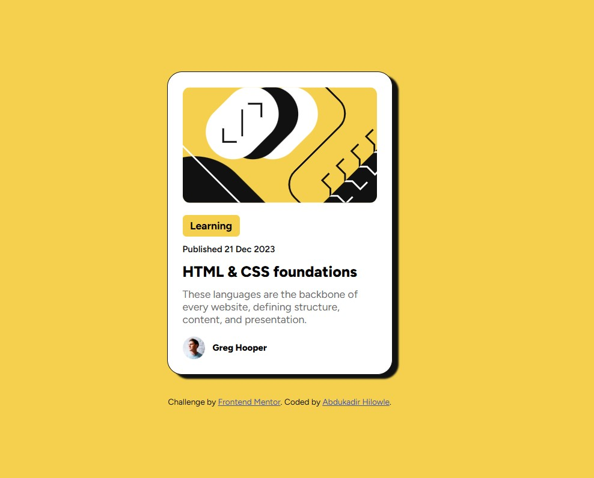

# Frontend Mentor - Blog Preview Card Solution

This is my solution to the [Blog Preview Card challenge on Frontend Mentor](https://www.frontendmentor.io/challenges/blog-preview-card-ckPaj01IcS). Frontend Mentor challenges help you improve your coding skills by building realistic projects using HTML and CSS.

## 📑 Table of Contents

- [Overview](#overview)
  - [The Challenge](#the-challenge)
  - [Links](#links)
- [My Process](#my-process)
  - [Built With](#built-with)
  - [What I Learned](#what-i-learned)
  - [Continued Development](#continued-development)
  - [Useful Resources](#useful-resources)
- [Author](#author)
- [Acknowledgments](#acknowledgments)

---

## 📌 Overview

### The Challenge

Users should be able to:
- View the blog card component
- See hover and focus states for all interactive elements

### Links

- 🔗 **Solution**: [GitHub Repository](https://github.com/icabduqaadir12/blog-preview-card)
- 🌐 **Live Site**: [GitHub Pages](https://icabduqaadir12.github.io/blog-preview-card/)

---

## 🚧 My Process

I started by analyzing the design provided by Frontend Mentor. I structured the layout using semantic HTML5 and styled it with mobile-first CSS. I focused on using Flexbox for alignment and spacing, and ensured the component was visually balanced with proper padding, typography, and border radius. I paid attention to details like button spacing and color contrast for accessibility and polished look.

### Built With

- Semantic **HTML5**
- **CSS Flexbox**
- **CSS custom properties**
- **Mobile-first** responsive design
- Clean and accessible layout

### What I Learned

- Writing clean and maintainable CSS using utility classes and spacing
- Structuring a component-based layout with clear visual hierarchy
- Applying responsive design techniques for small screens
- Improving code readability and consistency with variables and naming conventions

### Continued Development

- Learn and apply accessibility best practices
- Use SCSS or utility-first frameworks like Tailwind CSS
- Rebuild this component using JavaScript or React

### Useful Resources

- [MDN Web Docs](https://developer.mozilla.org/)
- [CSS Tricks: A Complete Guide to Flexbox](https://css-tricks.com/snippets/css/a-guide-to-flexbox/)
- [Frontend Mentor Discord](https://discord.gg/frontendmentor)

---

## 👤 Author

- GitHub – [@icabduqaadir12](https://github.com/icabduqaadir12)
- Frontend Mentor – [@icabduqaadir12](https://www.frontendmentor.io/profile/icabduqaadir12)

---

## 🙌 Acknowledgments

Thanks to [Frontend Mentor](https://www.frontendmentor.io) for the great challenge and the helpful community.  
Special thanks to those who give feedback and help others grow.
